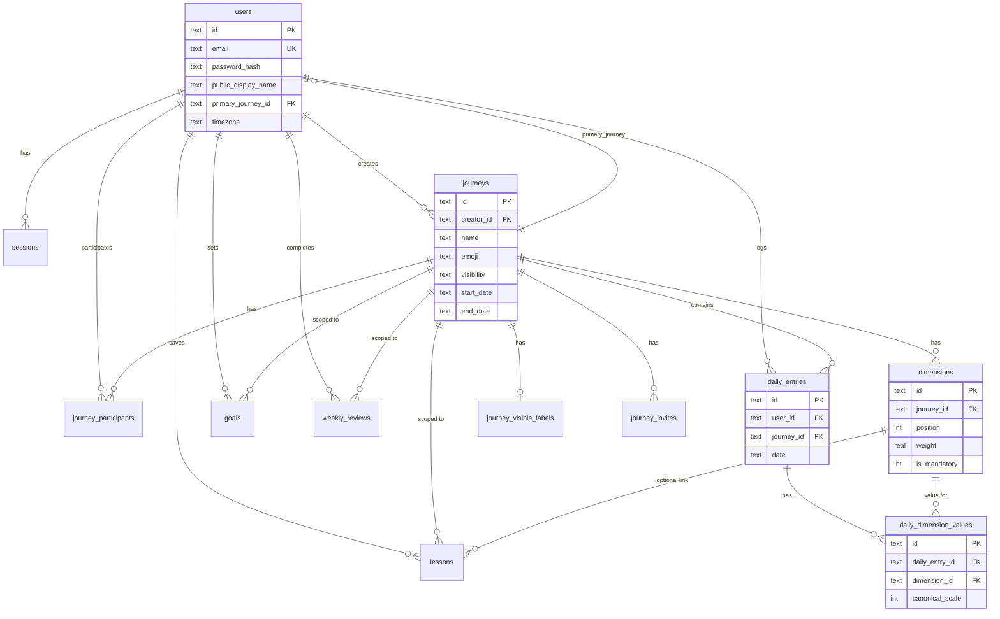

# Crimson Club — Entity-relationship view

High-level ER for the data model. Full field definitions in [data-model.md](data-model.md).

---

## Diagram (Mermaid)

---

## Relationship summary

| From | To | Cardinality | Description |
|------|-----|-------------|-------------|
| users | sessions | 1 : n | One user, many sessions |
| users | journeys | 1 : n | Creator; also primary_journey_id points to one journey |
| users | journey_participants | 1 : n | User in many journeys |
| journeys | journey_participants | 1 : n | Journey has many participants |
| journeys | dimensions | 1 : n | 2–8 dimensions per journey |
| journeys | journey_visible_labels | 1 : 1 | One label set per journey |
| users + journeys | daily_entries | 1 : n (per journey) | One entry per user per journey per day |
| daily_entries | daily_dimension_values | 1 : n | One value per dimension per entry |
| users + journeys | goals | 1 : n | Many goal rows (weekly/monthly, per period) |
| users + journeys | weekly_reviews | 1 : n | One per week per journey |
| users + journeys | lessons | 1 : n | Many lessons per journey |
| journeys | journey_invites | 1 : n | Pending invites for private journeys |

---

_Last updated: 2025-03-14_
